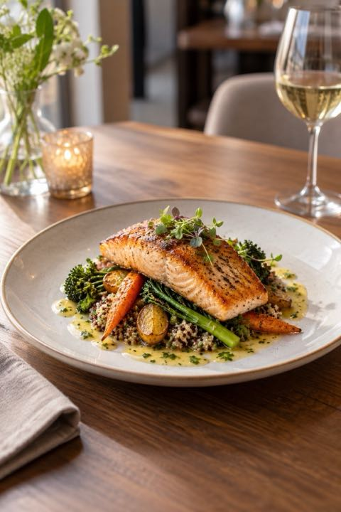
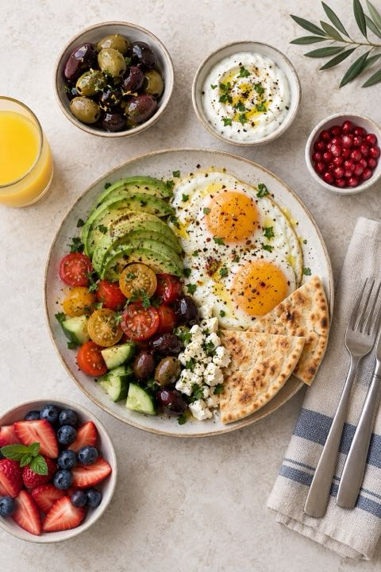
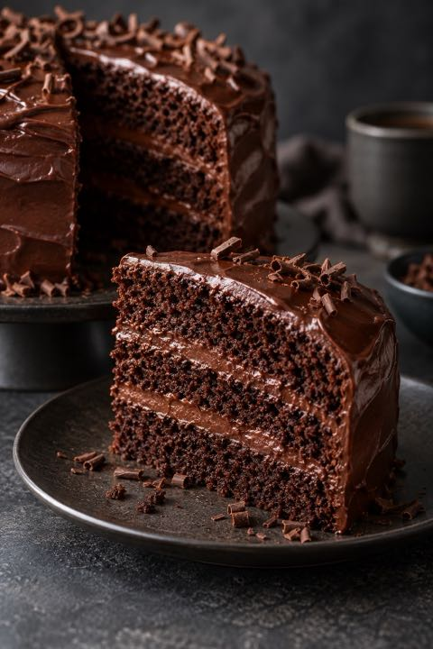
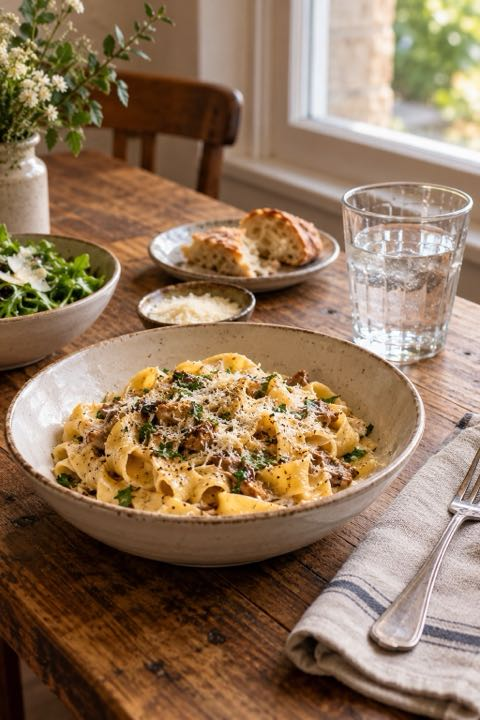
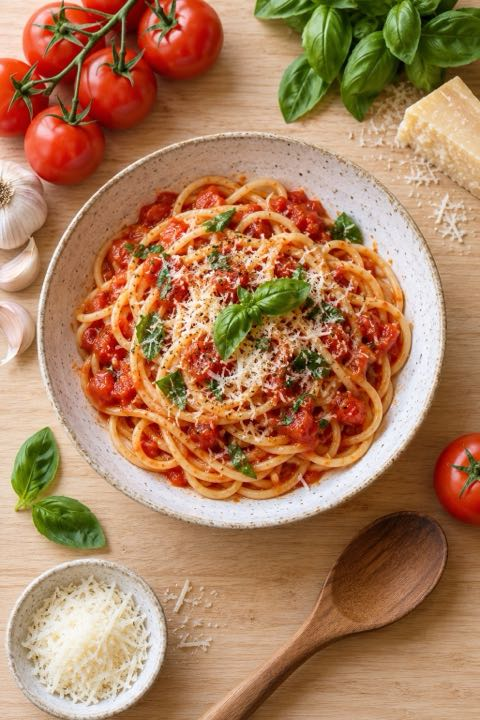
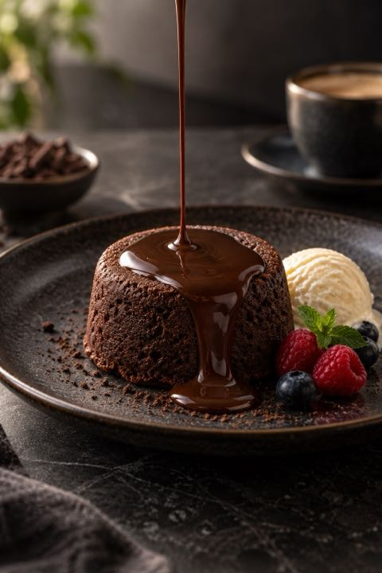

# Dali Camera Food Photography Package

Date: October 6, 2026  
Status: Six-recipe package implemented

## Implementation snapshot

- **Food** is a dedicated photographic situation, separate from people posture and landscape composition.
- Selecting Food reveals a **Food** control with Natural mode and six photo-based recipes.
- Every recipe supplies two short framing cues, a recommended camera angle, a lighting setup, a reference image, and a heat/spill safety note.
- Reference images are project-local JPEGs with a 720 px maximum long edge and a 95 KB export target.
- Selecting a recipe applies its recommended angle while keeping the shutter available.
- The active recipe card opens a full reference view with lighting and safety details.

## Recipe catalog

| ID | Recipe | Recommended angle | Best light | Coaching cues |
| --- | --- | --- | --- | --- |
| FD1 | Hero plate | 45-degree angle | Soft window side light | Turn the plate until its best edge faces the camera. Frame the entire plate and leave breathing room. |
| FD2 | Overhead flat lay | Overhead | Broad diffused light | Hold the phone parallel to the table. Balance the main dish with smaller items and clean frame edges. |
| FD3 | Texture detail | From the side | Low side light | Move close to one cut edge, layer, or crisp surface. Focus there and simplify the background. |
| FD4 | Table story | 45-degree angle | Soft window side light | Keep one dish as the hero. Use a glass, napkin, or side plate to create depth. |
| FD5 | Ingredient frame | Overhead | Broad diffused light | Place the finished dish near center. Use only a few relevant ingredients as a loose frame. |
| FD6 | Pour or action detail | 45-degree angle | Diffused back-side light | Set the phone before the pour. Keep the landing point sharp and leave room for the stream. |

## Visual reference set

| Hero plate | Overhead flat lay | Texture detail |
| --- | --- | --- |
|  |  |  |
| Table story | Ingredient frame | Pour or action detail |
|  |  |  |

## Safety principles

- Stabilize the phone before arranging food or beginning a pour.
- Never stand on a chair for an overhead view.
- Keep the phone and photographer away from active flames, hot cookware, steam, splashes, knives, and serving traffic.
- Move unsafe equipment out of the working area before moving closer for a detail.
- Food styling guidance controls composition only; it does not assess whether food is safe to eat.
